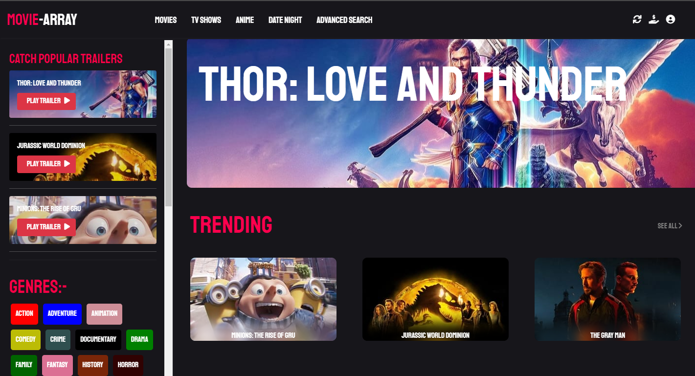
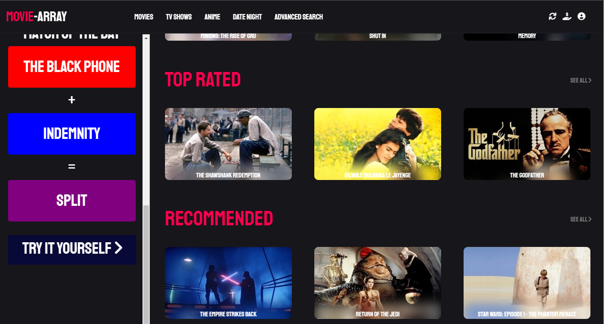
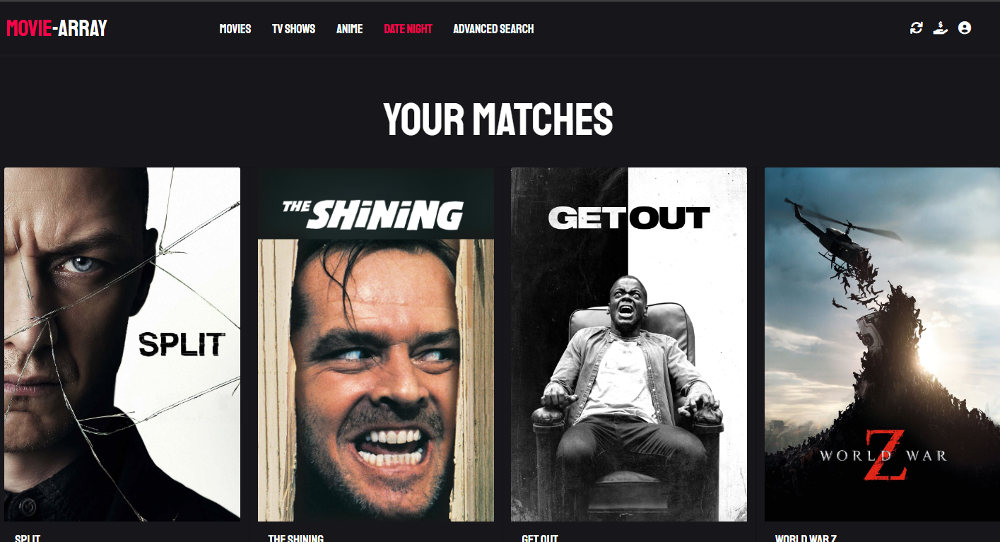
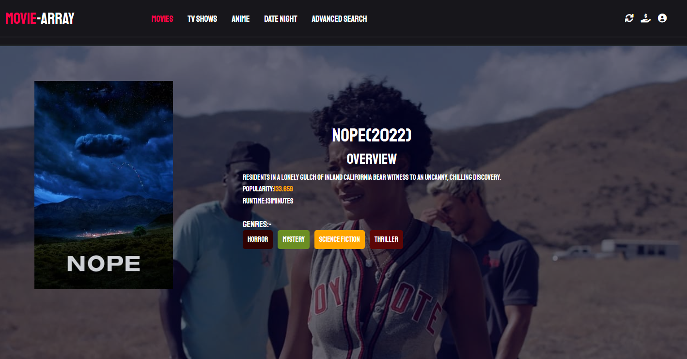
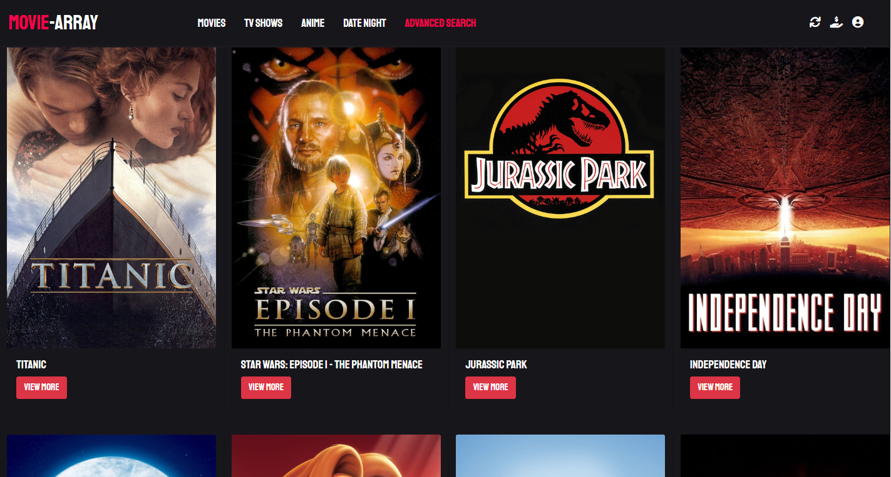

# Movie-Array:The Ultimate Movie Recommendation App 
## Tools Used
* ReactJS
* MovieDB API
* Mongo DB
* Express
* Node
* Bootstrap
---

## Features
* Date Night 
* Movie Details
* Advanced Search
### Date Night
### Finally, the answer to "What should we watch tonight?
---
###### Here you can find the match between two movies that you like or your loved ones does,using this you can find the most suitable movies according to your or their taste
---

### Details of Each Movie along with their Genres and Runtime
---
Movie Array gives you the Details of Movies along with their respective Genres,Runtime,Rating,etc.By Clicking on a genre you will be redirected to a page where you can find Movies under those Genres 

## Advanced Search that enables you to sort your movies in various categories
---
Advanced Search helps you to search movies with a whole lot of filters which includes popularity among the audience, period of release , runtime , alphabetical order and ratings

